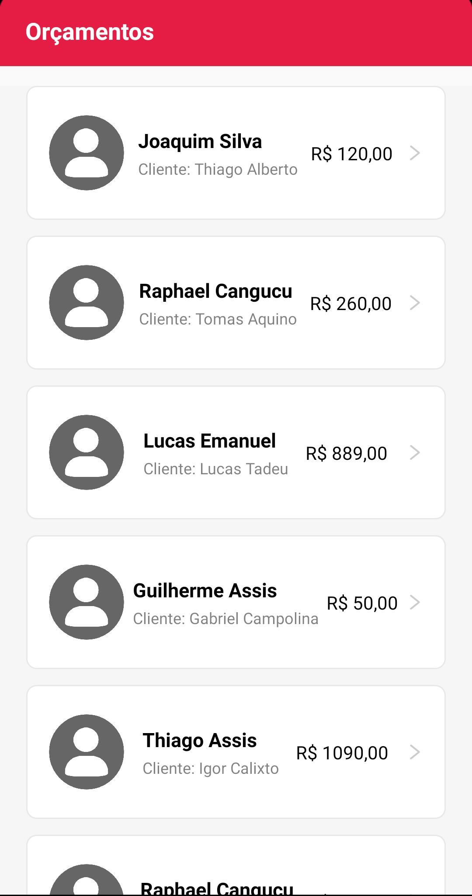
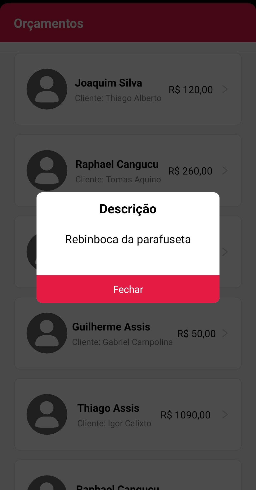

## 💻 Projeto

**Desafio** Técnico para vaga de estágio: Construir uma prova de conceito para realizar a venda de um projeto.\
**Descrição**: Oficina App, aplicativo que visa facilitar o acompanhamento dos pedidos de orçamento através do celular, para monitorar o volume de vendas de uma oficina. 

## 📋 Layout

<p align="center">
   
   
</p>

## ✨ Características 

-   Busca de dados da [api](https://my-json-server.typicode.com/codificar/oficina/proposals) 
-   Listagem de dados
-   Utilização de modal 


## 🛠️ Tecnologias

-  React Native
-  Expo
-  Vector Icons
-  Axios
-  React Native Gesture Handler
-  React Native Iphone X Helper


## Executando o projeto

Utilize o **npm** ou **yarn**  para instalar as dependências do projeto.

```
npm install || yarn install
```
Em seguida, inicie o projeto.

```
expo start
```


 
